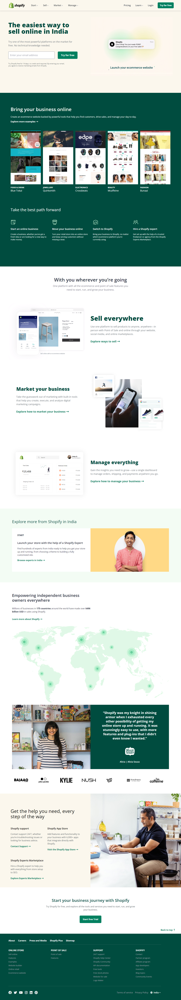
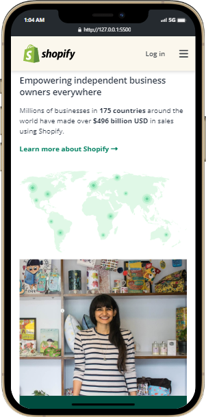
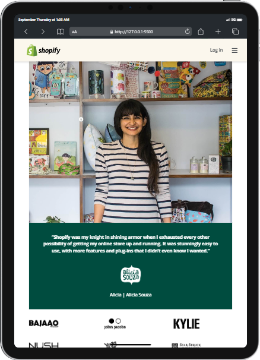
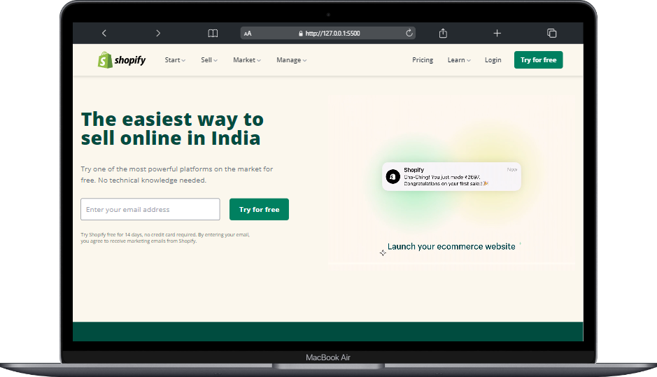
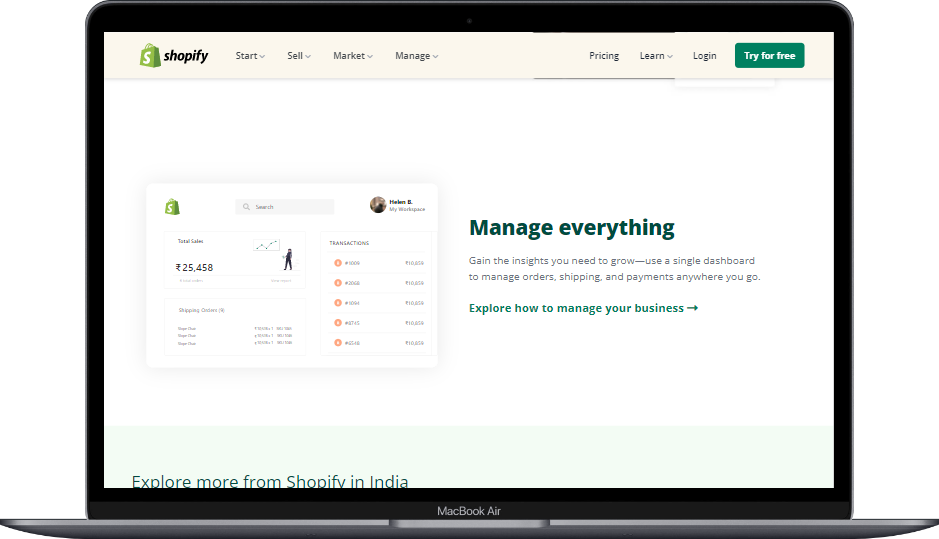

# Shopify Home Page

***
## Description

This project [Shopify Home Page](https://shopify-home.netlify.app/) was built using Semantic HTML and **Tailwind** from scratch. It took me almost 10 hours to make **Shopify** Home page clone. This is one of those websites which test your learning and writing the code which is efficient. **Tailwind** is a utility-first CSS framework in which we can directly write classes in the markup. This project helped me a lot in understanding the basic yet effective Tailwind concepts. This project hepled me understanding concepts like grid, animation & transistion in Tailwind css. The main learning after building this project is to make complex responsive design simpler and easier and faster with **Tailwindcss** screen breakpoints. Also a great credit to [Shopify](https://www.shopify.com/in) developers as I learnt best use case scenarios of Tailwind. The Project was completed under guidance of [Hitesh Choudhary](https://github.com/hiteshchoudhary), CTO Ineuron

***

### Links for Project

* [LIVE Project Link](https://shopify-home.netlify.app/)

* [Youtube Video Demo](https://youtu.be/Y5QKiEOg8Hk)

* [Source Code](https://github.com/ShubhamSingh03/Shopify_clone)

***
### Built With 

* Semantic HTML
* Tailwind CSS

***

### Key Learnings

* Learned to create drop-down menus on **click** on nav-items
* Learned to make responsive design for all devices without any hassels of media-queries and writing same css again & again
* Learned to use Grid and transistions.
* Learned to use videos on websites that matches the theme of webpage
* Learned to handle different sections under same section
* Learned to create a mega-menu footer
* Learned to read [Tailwinddocs](https://tailwindcss.com/docs/installation) more efficiently
* Used Tailwind components when necessary

***

### Time Taken to finish this project
 

>10 hours to build it from scratch(responsive design).

 

***

### Screencaptures of Project

 

  1. ### Whole Webpage

   

  

   

  2. ### Mobile View

 

 

  3. ### Tablet View 

   

  

   

  4. ### Large Screen View
 
   

  

   
  
  

   

***

### Checkout Portfolio & Other Projects

#### [Personal Portfolio](https://shubhambhoj.in/)

#### [Findcoder Profile](https://www.findcoder.io/u/shubham_singh)

***
### Connect with Me
* [Mailto](mailto:shubhambhoj3@gmail.com)
* [LinkedIn](https://www.linkedin.com/in/shubham-singh-b122b7171/)
* [Github](https://github.com/ShubhamSingh03)
* [Findcoder](https://www.findcoder.io/u/shubham_singh)
***
***
[go to top](#shopify-home-page)